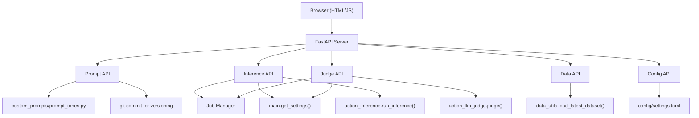

# Design Document: WRAVAL Webapp

## Overview

The WRAVAL Webapp adds a web-based interface on top of the existing WRAVAL CLI tool. It consists of a FastAPI backend that delegates to the existing `main.py` functions (`get_settings`, `run_inference`, `judge`) and a vanilla HTML/JS frontend served as static files. The backend is a thin wrapper — inference and judge jobs call the same code paths as the CLI commands. Prompt editing is the only new capability, using the existing `custom_prompts/` directory with git for version tracking.

The design maximizes reuse: the webapp imports and calls `get_settings()` from `wraval.main`, then passes the resulting settings to `run_inference()` and `judge()` exactly as the CLI does. No action logic is duplicated.

## Architecture



### Request Flow

1. Browser makes fetch() calls to FastAPI REST endpoints
2. FastAPI routes validate input and delegate to existing modules
3. For inference: calls `get_settings(model, tone, custom_prompts=True)` then `run_inference(settings, model, upload_s3=False, settings.data_dir)` — same as CLI
4. For judge: calls `get_settings(model, tone, custom_prompts=True)` then sets up boto3 client and calls `judge(settings, client, judge_model, upload_s3=False, endpoint_type)` — same as CLI
5. Long-running jobs (inference, judge) run in background threads via JobManager; browser polls for status
6. For prompts: reads/writes `src/wraval/custom_prompts/prompt_tones.py` and commits changes via git

## Components and Interfaces

### Backend Components

#### 1. FastAPI Application (`src/wraval/webapp/app.py`)

The main application entry point. Mounts API routers and serves static frontend files.

```python
from fastapi import FastAPI
from fastapi.staticfiles import StaticFiles

app = FastAPI(title="WRAVAL Webapp")

app.include_router(prompt_router, prefix="/api/prompts")
app.include_router(inference_router, prefix="/api/inference")
app.include_router(judge_router, prefix="/api/judge")
app.include_router(data_router, prefix="/api/data")
app.include_router(config_router, prefix="/api/config")
app.include_router(jobs_router, prefix="/api/jobs")

# Serve frontend as static files
app.mount("/", StaticFiles(directory="src/wraval/webapp/static", html=True))
```

#### 2. Prompt Router (`src/wraval/webapp/routers/prompts.py`)

Manages reading and writing prompt templates. Reads from and writes to `src/wraval/custom_prompts/prompt_tones.py` — the same file the CLI uses when `--custom-prompts` is enabled.

API Endpoints:
- `GET /api/prompts/tones` — List all tone names with their current prompt preview
- `GET /api/prompts/{tone}` — Get full system prompt and examples for a tone
- `PUT /api/prompts/{tone}` — Update system prompt and/or examples for a tone, then git commit

**Prompt editing approach**: The backend parses the existing `custom_prompts/prompt_tones.py` to read current prompts. When saving, it regenerates the Python file with updated prompt content and commits the change via `git add` + `git commit` with a descriptive message (e.g., `"webapp: update witty tone prompt"`). This keeps prompt history in git and avoids introducing a separate storage format.

The Python file is regenerated using a template approach — each Prompt subclass is written with the updated `sys_prompt` and `examples` values. The `master_sys_prompt` and class structure remain unchanged.

```python
# Prompt read: import and instantiate the class
from wraval.custom_prompts.prompt_tones import get_prompt, Tone
prompt = get_prompt(Tone.WITTY)
# prompt.sys_prompt, prompt.examples are the current values

# Prompt write: regenerate the Python file, then git commit
def save_prompt(tone: str, sys_prompt: str, examples: list):
    # 1. Read current file content
    # 2. Find and replace the class for this tone
    # 3. Write updated file
    # 4. git add + git commit
```

#### 3. Inference Router (`src/wraval/webapp/routers/inference.py`)

Triggers model inference as a background job, reusing the exact same code path as `wraval inference`.

API Endpoints:
- `POST /api/inference/run` — Start an inference job (body: `{model, tone}`)

Implementation:
```python
from wraval.main import get_settings
from wraval.actions.action_inference import run_inference

def run_inference_job(model: str, tone: str):
    settings = get_settings(model, tone, custom_prompts=True)
    run_inference(settings, model, upload_s3=False, data_dir=settings.data_dir)
```

The router wraps this in a JobManager background thread and returns the job ID.

#### 4. Judge Router (`src/wraval/webapp/routers/judge.py`)

Triggers LLM-as-a-judge evaluation as a background job, reusing the exact same code path as `wraval llm_judge`.

API Endpoints:
- `POST /api/judge/run` — Start a judge job (body: `{model, tone}`)

Implementation:
```python
from wraval.main import get_settings
from wraval.actions.action_llm_judge import judge
import boto3

def run_judge_job(model: str, tone: str):
    settings = get_settings(model, tone, custom_prompts=True)
    if settings.endpoint_type == "bedrock":
        judge_model = settings.model
        client = boto3.client("bedrock-runtime", region_name=settings.region)
    else:
        judge_model = model
        client = None
    judge(settings, client, judge_model, upload_s3=False, settings.endpoint_type)
```

#### 5. Data Router (`src/wraval/webapp/routers/data.py`)

Serves dataset contents for the data table view, reusing `load_latest_dataset()`.

API Endpoints:
- `GET /api/data/latest` — Load the latest dataset with optional filtering and pagination
  - Query params: `tone`, `model`, `page` (default 1), `page_size` (default 50)
- Returns: `{rows: [...], total: int, page: int, page_size: int, tones: [...], models: [...]}`

Implementation:
```python
from wraval.main import get_settings
from wraval.actions.data_utils import load_latest_dataset

def get_data(tone=None, model=None, page=1, page_size=50):
    settings = get_settings()
    df = load_latest_dataset(settings.data_dir)
    # Apply filters, paginate, return
```

#### 6. Config Router (`src/wraval/webapp/routers/config.py`)

Exposes model and tone configuration by parsing `config/settings.toml`.

API Endpoints:
- `GET /api/config/models` — List available model profile names and their endpoint types
- `GET /api/config/tones` — List available tone names (from Tone enum + "all")

Implementation parses settings.toml using `tomllib` (Python 3.11+) or `tomli` to extract section names that aren't "default".

#### 7. Job Manager (`src/wraval/webapp/jobs.py`)

Manages background job execution and status tracking. Uses threading locks to enforce one-job-per-type concurrency.

```python
class JobStatus(str, Enum):
    RUNNING = "running"
    COMPLETED = "completed"
    FAILED = "failed"

class JobType(str, Enum):
    INFERENCE = "inference"
    JUDGE = "judge"

@dataclass
class Job:
    id: str
    job_type: JobType
    status: JobStatus
    created_at: str
    model: str
    tone: str
    error: Optional[str] = None
    result_summary: Optional[str] = None

class JobManager:
    """In-memory job tracker with one-per-type concurrency control."""
    
    def __init__(self):
        self._jobs: dict[str, Job] = {}
        self._locks = {
            "inference": threading.Lock(),
            "judge": threading.Lock(),
        }

    def start_job(self, job_type: JobType, target_fn, kwargs) -> Job:
        lock = self._locks[job_type.value]
        if not lock.acquire(blocking=False):
            raise RuntimeError(f"A {job_type.value} job is already running")
        
        job_id = str(uuid.uuid4())[:8]
        job = Job(id=job_id, job_type=job_type, status=JobStatus.RUNNING,
                  created_at=datetime.utcnow().isoformat(),
                  model=kwargs.get("model", ""), tone=kwargs.get("tone", ""))
        self._jobs[job_id] = job

        def run():
            try:
                target_fn(**kwargs)
                job.status = JobStatus.COMPLETED
                job.result_summary = "Done"
            except Exception as e:
                job.status = JobStatus.FAILED
                job.error = str(e)
            finally:
                lock.release()

        threading.Thread(target=run, daemon=True).start()
        return job

    def get_job(self, job_id: str) -> Optional[Job]:
        return self._jobs.get(job_id)
```

Jobs Router (`src/wraval/webapp/routers/jobs.py`):
- `GET /api/jobs/{job_id}` — Get job status

### Frontend Components

The frontend is a single-page app using vanilla HTML, CSS, and JavaScript served as static files from `src/wraval/webapp/static/`.

#### File Structure
```
src/wraval/webapp/static/
├── index.html          # Main page with tab navigation
├── style.css           # Styles
└── app.js              # All frontend logic
```

#### UI Tabs
1. **Prompts** — Tone selector dropdown, system prompt textarea, examples editor (add/remove example pairs), save button. Save triggers PUT and shows git commit confirmation.
2. **Inference** — Model selector, tone selector, run button, job status polling display
3. **Judge** — Model selector, tone selector, run button, job status polling display
4. **Data** — Filterable (tone, model dropdowns), paginated data table showing input, rewrite, tone, model, score

## Data Models

### API Request/Response Models

```python
from pydantic import BaseModel, Field
from typing import Optional

# Prompt models
class PromptExample(BaseModel):
    user: str
    assistant: str

class PromptData(BaseModel):
    sys_prompt: str = Field(min_length=1)
    examples: list[PromptExample] = []

class ToneInfo(BaseModel):
    name: str

# Job models
class RunJobRequest(BaseModel):
    model: str
    tone: str = "all"

class JobResponse(BaseModel):
    id: str
    job_type: str
    status: str
    created_at: str
    model: str
    tone: str
    error: Optional[str] = None
    result_summary: Optional[str] = None

# Data models
class DataRow(BaseModel):
    synthetic_data: str
    rewrite: Optional[str] = None
    tone: str
    inference_model: Optional[str] = None
    overall_score: Optional[float] = None

class DataResponse(BaseModel):
    rows: list[DataRow]
    total: int
    page: int
    page_size: int
    tones: list[str]
    models: list[str]

# Config models
class ModelInfo(BaseModel):
    name: str
    endpoint_type: str

class ConfigResponse(BaseModel):
    models: list[ModelInfo]
    tones: list[str]
```

### Prompt Storage

Prompts are stored in `src/wraval/custom_prompts/prompt_tones.py` — the same Python file the CLI reads when `--custom-prompts` is enabled. The webapp always passes `custom_prompts=True` to `get_settings()` so inference and judge use the edited prompts.

When a prompt is saved via the UI:
1. The backend regenerates the relevant Prompt subclass in `prompt_tones.py`
2. Runs `git add src/wraval/custom_prompts/prompt_tones.py`
3. Runs `git commit -m "webapp: update {tone} tone prompt"`
4. Returns success with the git commit hash

### Dataset Format (existing, unchanged)

CSV files in the configured `data_dir` with columns:
- `uuid`, `synthetic_data`, `tone`, `rewrite`, `inference_model`, `overall_score`, plus rubric-specific score columns


## Correctness Properties

*A property is a characteristic or behavior that should hold true across all valid executions of a system — essentially, a formal statement about what the system should do. Properties serve as the bridge between human-readable specifications and machine-verifiable correctness guarantees.*

### Property 1: Prompt save/load round-trip

*For any* valid tone name and any PromptData with a non-empty sys_prompt and a list of examples, saving the prompt via PUT and then loading it via GET should return an equivalent PromptData object.

**Validates: Requirements 1.3**

### Property 2: Empty/whitespace prompt rejection

*For any* string composed entirely of whitespace characters (including the empty string), attempting to save it as a sys_prompt should be rejected with a validation error, and the previously stored prompt should remain unchanged.

**Validates: Requirements 1.4**

### Property 3: Tones API completeness

*For any* set of tones defined in the Tone enum, the GET /api/config/tones endpoint should return a list containing all defined tone names plus "all".

**Validates: Requirements 1.1, 2.2, 5.2**

### Property 4: Prompt retrieval returns valid data for all tones

*For any* valid tone name from the defined set, the GET /api/prompts/{tone} endpoint should return a response containing a non-empty sys_prompt string.

**Validates: Requirements 1.2**

### Property 5: Model profiles API returns all configured models

*For any* settings.toml containing model profile sections (sections other than "default"), the GET /api/config/models endpoint should return a list containing all model profile names, each with a non-empty endpoint_type field.

**Validates: Requirements 2.1, 5.1, 5.3**

### Property 6: Data table rows contain required fields

*For any* dataset row returned by the data API, the row should contain the fields: synthetic_data, tone, rewrite, inference_model, and overall_score.

**Validates: Requirements 4.2**

### Property 7: Tone filter returns only matching rows

*For any* tone filter value and any dataset, all rows returned by the data API with that tone filter should have a tone field equal to the filter value.

**Validates: Requirements 4.3**

### Property 8: Model filter returns only matching rows

*For any* model filter value and any dataset, all rows returned by the data API with that model filter should have an inference_model field equal to the filter value.

**Validates: Requirements 4.4**

### Property 9: Pagination respects page size

*For any* page size N and any dataset, the number of rows returned by the data API should be at most N, and the total field should reflect the full count of matching rows.

**Validates: Requirements 4.5**

### Property 10: Job IDs are unique

*For any* sequence of jobs started via the JobManager, all returned job IDs should be distinct.

**Validates: Requirements 6.1**

### Property 11: Job status reflects outcome

*For any* job function that completes normally, the job status should be "completed". For any job function that raises an exception, the job status should be "failed" with a non-empty error message.

**Validates: Requirements 6.3**

### Property 12: Concurrent job type rejection

*For any* job type (inference or judge), if a job of that type is already running, attempting to start another job of the same type should raise an error. Starting a job of a different type should succeed.

**Validates: Requirements 6.4**

### Property 13: Invalid API requests return error responses

*For any* API endpoint that requires a request body, sending a request with missing required fields or invalid types should return an HTTP 4xx status code with a JSON body containing an error description.

**Validates: Requirements 7.3**

## Error Handling

| Scenario | Handling |
|---|---|
| File system error on prompt save | Return HTTP 500 with error message describing the I/O failure |
| Git commit fails (e.g., no git repo) | Return HTTP 500 with git error message; prompt file changes are still saved |
| Invalid tone name in API request | Return HTTP 404 with "Tone not found" message |
| Invalid model name in job request | Return HTTP 400 with "Unknown model profile" message |
| Inference/judge job fails mid-execution | JobManager catches exception, sets job status to "failed" with error string |
| Concurrent job of same type | Return HTTP 409 (Conflict) with message that a job is already running |
| No dataset found in data directory | Return HTTP 200 with empty rows list and a message field indicating no data |
| settings.toml parse failure | Application fails to start with descriptive error in logs |
| AWS credentials missing/expired | Job fails with boto3 error message propagated to job status |

## Testing Strategy

### Testing Framework

- **Unit/integration tests**: `pytest` with `httpx` for FastAPI TestClient
- **Property-based tests**: `hypothesis` library for Python
- Each property test runs a minimum of 100 iterations

### Unit Tests

Unit tests cover specific examples and edge cases:
- Prompt CRUD operations with known tone values
- Git commit is created after prompt save
- Job lifecycle (start → poll → complete/fail)
- Data API with a fixture CSV file
- Config parsing with a known settings.toml
- Error responses for invalid inputs

### Property-Based Tests

Each correctness property maps to a single `hypothesis` test:

- **Property 1**: Generate random PromptData (non-empty sys_prompt, random examples), save via API, load via API, assert equality
  - Tag: **Feature: wraval-webapp, Property 1: Prompt save/load round-trip**
- **Property 2**: Generate whitespace-only strings, attempt save, assert rejection and unchanged state
  - Tag: **Feature: wraval-webapp, Property 2: Empty/whitespace prompt rejection**
- **Property 3**: Assert tones endpoint returns superset of all Tone enum values plus "all"
  - Tag: **Feature: wraval-webapp, Property 3: Tones API completeness**
- **Property 4**: For each tone in the enum, GET prompt returns non-empty sys_prompt
  - Tag: **Feature: wraval-webapp, Property 4: Prompt retrieval returns valid data**
- **Property 5**: Parse a generated settings.toml with random model sections, assert all appear in API response with endpoint_type
  - Tag: **Feature: wraval-webapp, Property 5: Model profiles completeness**
- **Property 6**: Generate random DataFrames with required columns, serve via API, assert all rows have required fields
  - Tag: **Feature: wraval-webapp, Property 6: Data rows contain required fields**
- **Property 7**: Generate datasets with multiple tones, filter by one, assert all returned rows match
  - Tag: **Feature: wraval-webapp, Property 7: Tone filter correctness**
- **Property 8**: Generate datasets with multiple models, filter by one, assert all returned rows match
  - Tag: **Feature: wraval-webapp, Property 8: Model filter correctness**
- **Property 9**: Generate datasets of varying sizes, request with page_size N, assert len(rows) <= N and total is correct
  - Tag: **Feature: wraval-webapp, Property 9: Pagination respects page size**
- **Property 10**: Start N jobs with mock functions, collect IDs, assert all unique
  - Tag: **Feature: wraval-webapp, Property 10: Job ID uniqueness**
- **Property 11**: Start jobs with functions that either return or raise, assert status matches outcome
  - Tag: **Feature: wraval-webapp, Property 11: Job status reflects outcome**
- **Property 12**: Start a long-running job, attempt second of same type, assert rejection; attempt different type, assert success
  - Tag: **Feature: wraval-webapp, Property 12: Concurrent job rejection**
- **Property 13**: Send requests with randomly corrupted/missing fields, assert 4xx responses
  - Tag: **Feature: wraval-webapp, Property 13: Invalid requests return errors**
